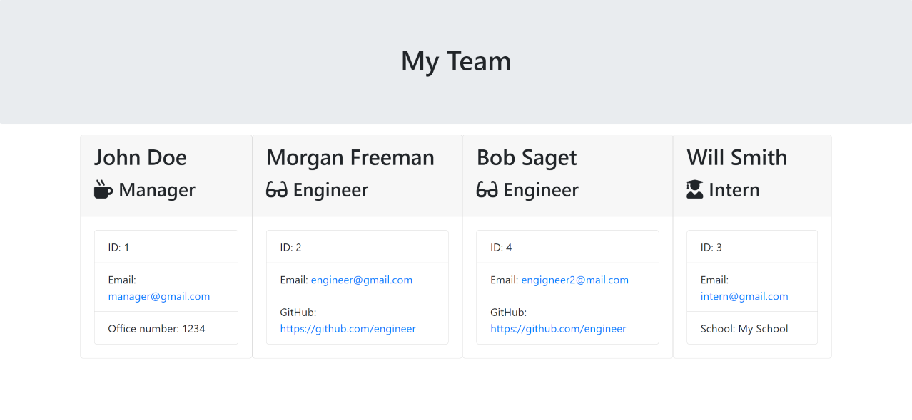

# Team Profile Generator
A console application that generates a HTML file for a Development Team.

## Table of Contents
- [Instructions](#instructions)
- [Tests](#tests)
- [Screenshot-1](#screenshot-1)
- [Screenshot-2](#screenshot-2)
- [Questions](#questions)

## Instructions
To run this application, you'll need to installed node.js on your machine. Open command prompt and type `node -v` to check if node.js is already installed. If not, you can follow this [link](https://nodejs.org/en) to installed it.

Once installed, clone or download this project. Open command prompt at the same location and type `node index.js` to run it.

After answering a several question about the team, the application will generate the HTML file in the "output" folder as "team.html" file.

## Tests
Enter `node jest` into the console to check if the tests pass.

## Screenshot-1
A preview of the console application

## Screenshot-2 
A preview of the generated HTML file.

## Questions
If you have any questions, please contact [Gjorgji Krstevski](https://github.com/joekrstevskigj) or email krstevskigj@gmail.com.

